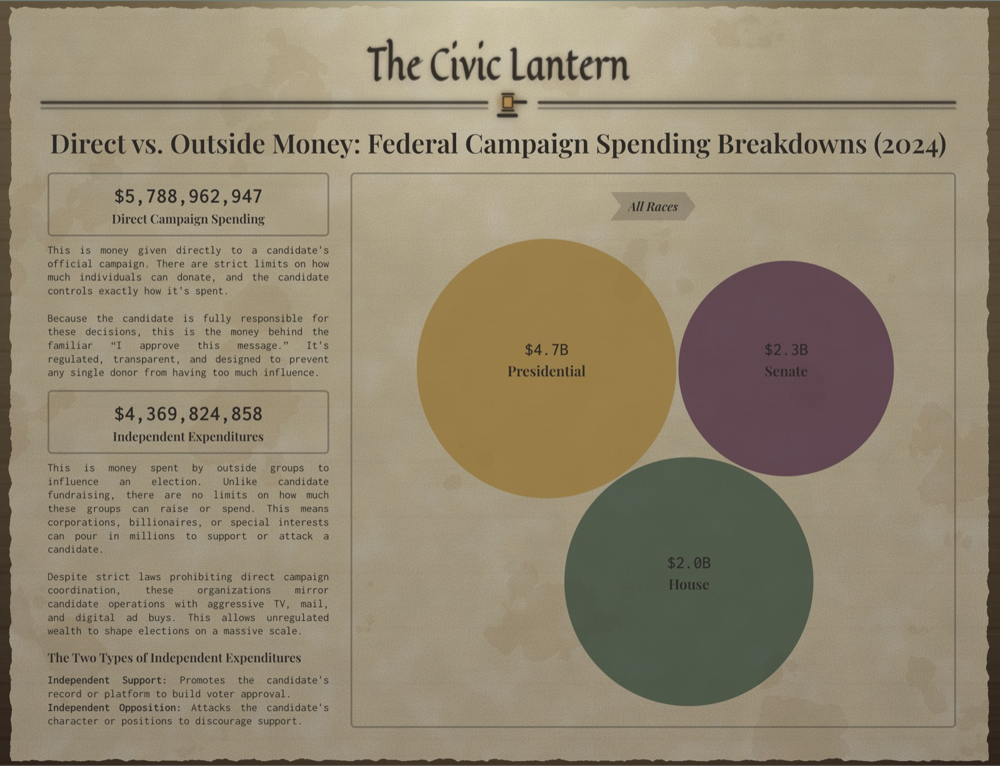

# Civic Lantern

**Illuminating dark money flows in American politics.**

Civic Lantern is a campaign finance transparency platform that ingests data from the [Federal Election Commission (FEC) API](https://api.open.fec.gov/developers/) and exposes it through a clean REST API. It tracks both inside spending (official candidate disbursements) and outside spending (independent expenditures from Super PACs and dark money groups), making it easy to see who is funding — or targeting — a candidate.



---

## Why This Exists

Campaign finance data is public, but the FEC's raw data is enormous, inconsistently structured, and hard to query. Civic Lantern pipelines that data into a structured PostgreSQL database and surfaces it through queryable endpoints. The goal is to make influence patterns visible — which candidates depend heavily on outside money, which face the most opposition spending, and how election cycles compare.

---

## Architecture

```
civic-lantern/
├── backend/        # FastAPI + PostgreSQL data pipeline and REST API
└── frontend/       # Next.js UI — election spending dashboard
```

For setup, schema, and implementation details for each half, see:

- [`backend/README.md`](backend/README.md) — API, database schema, ingestion pipeline
- [`frontend/README.md`](frontend/README.md) — dashboard structure, data flow, dev commands

### Backend Stack

| Layer | Technology |
|---|---|
| API framework | FastAPI |
| Database | PostgreSQL 17 |
| ORM | SQLAlchemy 2.0 (async) |
| Validation | Pydantic v2 |
| Migrations | Alembic |
| HTTP client | httpx (async) |
| Rate limiting | aiolimiter |
| Retry logic | tenacity |
| Package manager | Poetry |

### Frontend Stack

| Layer | Technology |
|---|---|
| Framework | Next.js 16 (App Router) |
| Language | TypeScript 5 |
| UI library | React 19 |
| Styling | Tailwind CSS 4 |
| Build tool | Next.js Turbo |
| Package manager | npm |

---

## Key Features

### Election Spending Dashboard

The frontend surfaces campaign finance data as a readable, newspaper-style UI. For a given election cycle it displays:

- **Direct Campaign Spending** — total official candidate disbursements (inside money), with plain-language context explaining donation limits and candidate accountability
- **Independent Expenditures** — total outside spending from Super PACs and dark money groups (support + oppose combined), with context on the absence of contribution caps

Data is fetched server-side via Next.js React Server Components and streamed to the client using `<Suspense>` boundaries, so each metric loads independently without blocking the page.

### Resilient Data Ingestion Pipeline

- Fetches paginated data from the FEC API with a rate limiter respecting the 900 req/hr cap
- Validates every record through Pydantic schemas at ingestion boundaries — malformed records are logged and skipped without halting the pipeline
- Idempotent batch upserts (`INSERT ... ON CONFLICT DO UPDATE`) mean the pipeline is safe to re-run at any time
- On batch failure, falls back to row-by-row inserts to isolate the bad record rather than dropping the whole batch

### Analytics via Materialized Views

A PostgreSQL materialized view (`mv_election_spending_summary`) pre-computes election-level metrics:

- **Influence ratio** — outside spending (support + oppose) relative to the candidate's own disbursements
- **Vulnerability factor** — opposition spending relative to the candidate's disbursements

These are refreshed `CONCURRENTLY` so reads are never blocked during an update.

### Automatic Timestamps via PostgreSQL Triggers

All models use a `TimestampMixin` backed by a server-side PostgreSQL trigger. `created_at` is set at insert time and excluded from upsert updates; `updated_at` is managed entirely by the database, eliminating application clock skew.

---

## API Overview

Base path: `/api/v1`. All endpoints are read-only (`GET`).

| Method | Endpoint | Description |
|---|---|---|
| `GET` | `/candidates` | List candidates — filterable by state, office, election cycle; sortable and paginated |
| `GET` | `/candidates/{candidate_id}` | Full detail for a single candidate |
| `GET` | `/candidates/{candidate_id}/spending` | Spending history across cycles for one candidate |
| `GET` | `/candidate-spending` | All candidate spending totals for a cycle, sortable and paginated |
| `GET` | `/election-spending` | All election-level spending summaries |
| `GET` | `/election-spending/{cycle}` | Spending summary for a specific (even-year) election cycle |

Interactive docs available at `/docs` (Swagger UI) when the server is running. Full request/response details are in [`backend/README.md`](backend/README.md#api).

---

## Local Setup

### Prerequisites

- Python 3.11+
- Node.js 20+
- [Poetry](https://python-poetry.org/)
- Docker (for PostgreSQL)
- An [FEC API key](https://api.data.gov/signup/) (free)

Clone the repo, then set up each half independently — full steps (env vars, migrations, running the ingestion pipeline, running tests) are in their READMEs:

```bash
git clone https://github.com/your-username/civic-lantern.git
cd civic-lantern
```

- **Backend:** see [`backend/README.md`](backend/README.md#local-setup) — runs at `http://localhost:8000` (`/docs` for the interactive API explorer)
- **Frontend:** see [`frontend/README.md`](frontend/README.md#local-setup) — runs at `http://localhost:3000`, and needs `NEXT_PUBLIC_API_URL` pointed at the backend above

---

## Testing

Each half has its own test suite — see [`backend/README.md`](backend/README.md#testing) (pytest: unit + integration) and [`frontend/README.md`](frontend/README.md#testing) (Vitest).

---

## Data Model

The core tables (see [`backend/README.md`](backend/README.md#database) for full schema):

| Table | Description |
|---|---|
| `candidates` | Candidate records keyed on FEC `candidate_id` |
| `committees` | PAC and committee registrations |
| `inside_totals_by_candidate` | Candidates' own fundraising (receipts/disbursements) per cycle |
| `schedule_e_totals_by_candidate` | Independent-expenditure totals per candidate/cycle, split support vs. oppose |
| `mv_candidate_spending_summary` | Materialized view — per-candidate, per-cycle inside vs. outside totals and influence/vulnerability ratios |
| `mv_election_spending_summary` | Materialized view — election-level analytics, rolled up from the view above |

---

## Project Status

The backend data pipeline and REST API are functional. The frontend is live with an election spending dashboard for the 2024 cycle. Current development is focused on expanding ingestion coverage, adding deeper analytical endpoints, and building out additional frontend views.

---

## License

This project is open source. See [LICENSE](LICENSE) for details.
